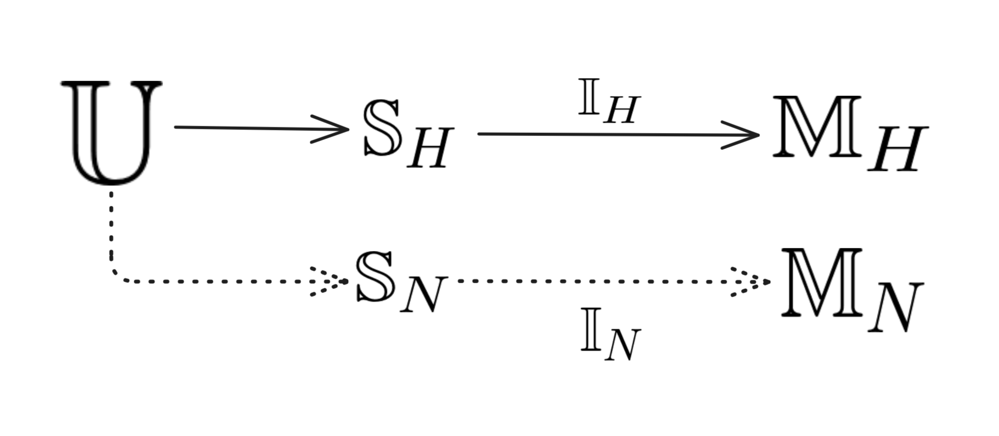

# Conceptual-Framework-for-Learning-and-Cognition
Formal framework for modeling learning and understanding in systems.

## Abstract
This article provides a unified, formal framework for understanding how systems acquire, interpret,
and act upon information. It highlights that any system’s knowledge and understanding arise from its
internal mapping of sensory inputs to outputs, shaped by value and cost functions, and constrained by
its architecture. We assume that each system only observes the world through its own sensory channels,
that its capacity for conceptualizing and responding to the environment is limited and can change
over time, and that learning is guided by intrinsic and extrinsic signals. Under these assumptions,
intelligence, understanding, and communication between different minds are shown to depend on
overlapping representational capabilities and the interplay between internal conceptual structures and
external feedback.

## Why...
This is obviously more of a "mental exercise" of some random idea I've been thinking for a while. This is not supposed to be a formal definition that is exhaustively tested and proved. I'll leave thay for more intelligent people.
